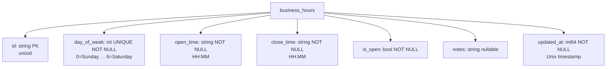

# business-hours — Documentation Plan

> **Goal:** Create the complete standard documentation set so the module has a clear
> architecture reference, LLM-friendly skill summary, a database diagram, and a rich README
> that acts as an index.
>
> **No code changes.** This plan is documentation-only.

---

## Development Rules

- **Agent Setup:** Run `go install github.com/tinywasm/devflow/cmd/gotest@latest` before anything.
- **No external libraries.** Standard library + `tinywasm/*` polyfills only.
- **Build Tags:** All server-side files carry `//go:build !wasm`. Do not alter them.
- **Publishing:** Run `gopush 'docs: add architecture, skill and diagrams'`. Never `git commit/push` directly.
- **Diagram format:** Mermaid inside a `*.md` file stored in `docs/diagrams/`. Use `flowchart TD`. Never use `subgraph`.

---

## Context: What the module does

`business-hours` manages the **weekly operating schedule** of the clinic. Each row in
`business_hours` represents one day of the week (0=Sunday … 6=Saturday) with open/close
times and an optional note.

**MCP Tools exposed (via `RegisterProvider`):**

| Tool | Description |
|------|-------------|
| `get_business_hours` | Returns the full weekly schedule (all 7 days, sorted `day_of_week ASC`). No parameters. |

**Schema (`business_hours` table):**

| Field | Type | Constraint |
|-------|------|------------|
| `id` | string | PK (unixid) |
| `day_of_week` | int | UNIQUE, NOT NULL (0–6) |
| `open_time` | string | NOT NULL ("HH:MM") |
| `close_time` | string | NOT NULL ("HH:MM") |
| `is_open` | bool | NOT NULL |
| `notes` | string | nullable |
| `updated_at` | int64 | NOT NULL (Unix timestamp) |

---

## Step 1 — Create `docs/ARCHITECTURE.md`

Create the file `docs/ARCHITECTURE.md` with the following content:

```markdown
# business-hours Architecture

## 1. Domain Scope
Manages the weekly operating schedule of the clinic. Provides a single source of truth for
which days the clinic is open and during which hours.

## 2. Core Entity
- **BusinessHours:** One row per day of the week (UNIQUE constraint on `day_of_week`).
  Stores open/close times, open flag, optional notes, and the timestamp of the last update.

## 3. Architectural Patterns
1. **Dependency Injection:** `New(db *orm.DB)` performs schema migration and returns `*Module`.
   No global state.
2. **Module-owned Migration:** `New(db)` calls `db.CreateTable(&BusinessHours{})`.
   The CMS layer does not manage this table's schema.
3. **MCP Self-Registration:** `*Module` implements `mcp.ToolProvider` via `GetMCPToolsMetadata()`.
   Registered onto an `*mcp.MCPServer` via `RegisterTools(srv)`.
4. **unixid IDs:** Row `ID` generated by `unixid`. `UpdatedAt` is a plain Unix timestamp
   managed at the application layer.

## 4. MCP Tools
| Tool | Parameters | Returns |
|------|-----------|---------|
| `get_business_hours` | — | `schedule[]` (day, day_name, is_open, open, close, notes) |

The response uses human-readable Spanish day names (Domingo … Sábado).
`open` and `close` fields are omitted when `is_open = false`.

## 5. Schema
See [`docs/diagrams/database.md`](diagrams/database.md).
```

---

## Step 2 — Create `docs/diagrams/database.md`

Create the file `docs/diagrams/database.md`:

````markdown
# business-hours — Database Diagram



> **Read strategy:** `SELECT ... ORDER BY day_of_week ASC` — returns all 7 days in order.
> Only UPSERT operations are expected (one row per day of the week).
````

---

## Step 3 — Create `docs/SKILL.md`

Create the file `docs/SKILL.md`:

```markdown
# business-hours — LLM Skill Summary

## Purpose
Manages the clinic's weekly operating schedule. One row per day (0–6).
The `get_business_hours` MCP tool is the single read endpoint.

## Key Files
| File | Role |
|------|------|
| `model.go` | `BusinessHours` struct + `TableName()` |
| `model_orm.go` | Auto-generated ORM helpers — DO NOT EDIT |
| `mcp.go` | `Module`, `New(db)`, `GetMCPToolsMetadata()`, `RegisterTools()`, `GetBusinessHours()`, `buildScheduleResponse()` |
| `mcp_test.go` | All tests (`!wasm` build tag, `:memory:` SQLite) |

## Constraints
- `New(db)` calls `db.CreateTable(&BusinessHours{})` — module owns migration.
- `day_of_week` has a UNIQUE constraint; expect one row per day.
- `open`/`close` fields omitted from response when `is_open = false`.
- Spanish day names: Domingo, Lunes, Martes, Miércoles, Jueves, Viernes, Sábado.

## MCP Registration
```go
m, _ := businesshours.New(db)
m.RegisterTools(srv) // srv is *mcp.MCPServer
```
```

---

## Step 4 — Update `README.md`

Replace the current minimal `README.md` with:

```markdown
# business-hours
<!-- START_SECTION:BADGES_SECTION -->
<a href="docs/img/badges.svg"></a>
<!-- END_SECTION:BADGES_SECTION -->

Weekly business operating hours MCP module. Provides a single `get_business_hours` MCP tool
that returns the clinic's full weekly schedule.

## MCP Tools

| Tool | Parameters | Description |
|------|-----------|-------------|
| `get_business_hours` | — | Returns the 7-day weekly schedule sorted by `day_of_week`. |

## Quick Start

```go
import businesshours "github.com/veltylabs/business-hours"

m, err := businesshours.New(db)  // creates table + initialises module
m.RegisterTools(srv)             // registers MCP tools on *mcp.MCPServer
```

## Documentation

| Document | Description |
|----------|-------------|
| [ARCHITECTURE.md](docs/ARCHITECTURE.md) | Domain scope, patterns, and MCP tool reference |
| [Database Diagram](docs/diagrams/database.md) | Schema diagram |
| [SKILL.md](docs/SKILL.md) | LLM-friendly condensed summary |
```

---

## Step 5 — Verify & Submit

```bash
gotest

gopush 'docs: add architecture, database diagram, skill summary and enrich README'
```
