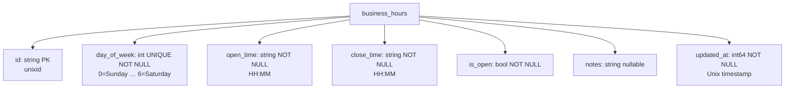

# business-hours — Database Diagram

```mermaid
flowchart TD
    A[business_hours]
    A --> B[id: string PK<br/>unixid]
    A --> C[day_of_week: int UNIQUE NOT NULL<br/>0=Sunday … 6=Saturday]
    A --> D[open_time: string NOT NULL<br/>HH:MM]
    A --> E[close_time: string NOT NULL<br/>HH:MM]
    A --> F[is_open: bool NOT NULL]
    A --> G[notes: string nullable]
    A --> H[updated_at: int64 NOT NULL<br/>Unix timestamp]
```

> **Read strategy:** `SELECT ... ORDER BY day_of_week ASC` — returns all 7 days in order.
> Only UPSERT operations are expected (one row per day of the week).